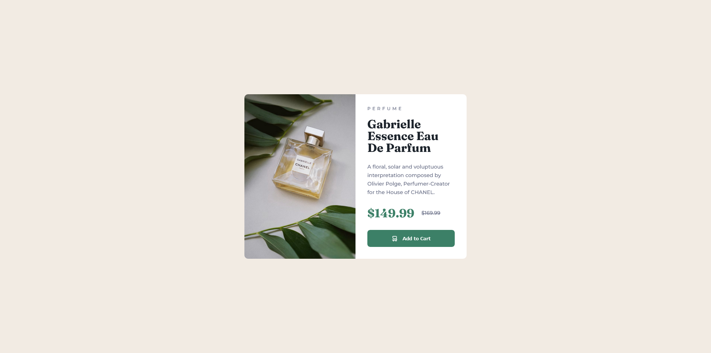

# Frontend Mentor - Product preview card component solution

This is a solution to the [Product preview card component challenge on Frontend Mentor](https://www.frontendmentor.io/challenges/product-preview-card-component-GO7UmttRfa). Frontend Mentor challenges help you improve your coding skills by building realistic projects. 

## Table of contents

- [Frontend Mentor - Product preview card component solution](#frontend-mentor---product-preview-card-component-solution)
  - [Table of contents](#table-of-contents)
  - [Overview](#overview)
    - [The challenge](#the-challenge)
    - [Screenshot](#screenshot)
    - [Links](#links)
  - [My process](#my-process)
    - [Built with](#built-with)
    - [What I learned](#what-i-learned)
    - [Continued development](#continued-development)
    - [Useful resources](#useful-resources)
  - [Author](#author)
  - [Acknowledgments](#acknowledgments)

## Overview

### The challenge

Users should be able to:
- View the product card with a responsive design that adapts to different screen sizes.
- See the hover states for the "Add to Cart" button.
- Experience a clean and modern layout based on the provided design files.

### Screenshot



### Links

- Solution URL: [GitHub Repository](https://github.com/dantvi/product-preview-card-component)
- Live Site URL: [DT Code](https://product-preview-card-component.dtcode.se/)

## My process

### Built with

- Semantic HTML5 markup for clear structure and better accessibility.
- CSS custom properties to maintain consistent theming.
- Flexbox and Grid for layout alignment and responsiveness.
- Mobile-first workflow to ensure smooth adaptation for all screen sizes.
- Google Fonts for modern typography styling.

### What I learned

This challenge helped me refine my understanding of:
- CSS Grid:
  - Structured the card layout for desktop screens using a two-column grid.
- Responsive Design:
  - Implemented media queries to adjust the layout, images, and spacing for tablet and desktop devices.
- Hover Effects:
  - Created an interactive hover state for the "Add to Cart" button.

Here’s an example of the grid layout used for the desktop design:

```css
.card {
    display: grid;
    grid-template-columns: auto auto;
    width: 600px;
}
```

### Continued development

In future projects, I aim to:
- Explore more advanced interactive elements, such as quantity selectors for product cards.
- Implement subtle animations on hover to enhance user experience.
- Focus on improving accessibility by incorporating ARIA roles and testing with screen readers.

### Useful resources

- [MDN Web Docs: CSS Grid](https://developer.mozilla.org/en-US/docs/Web/CSS/CSS_grid_layout) - Helped structure the desktop layout effectively.
- [CSS Tricks: Transitions](https://css-tricks.com/almanac/properties/t/transition/) - Guided the creation of smooth hover effects.

## Author

- Frontend Mentor - [@dantvi](https://www.frontendmentor.io/profile/dantvi)
- GitHub - [@dantvi](https://github.com/dantvi)
- LinkedIn - [@danieltving](https://www.linkedin.com/in/danieltving/)

## Acknowledgments

Thanks to Frontend Mentor for providing this straightforward yet engaging challenge. The clear design specifications and structured requirements allowed me to focus on refining my layout and styling skills.
